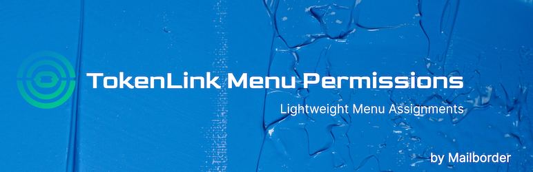
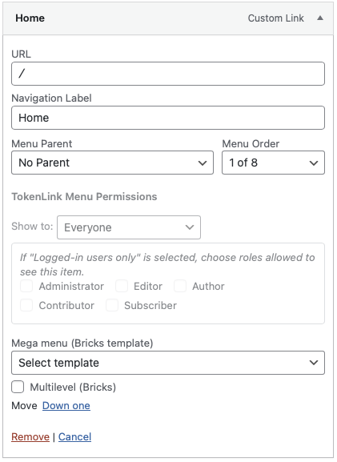
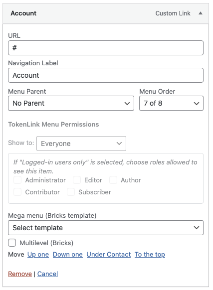
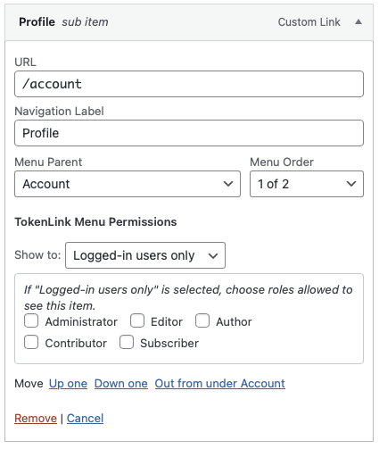
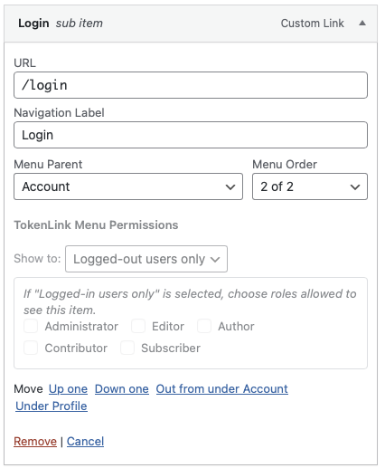
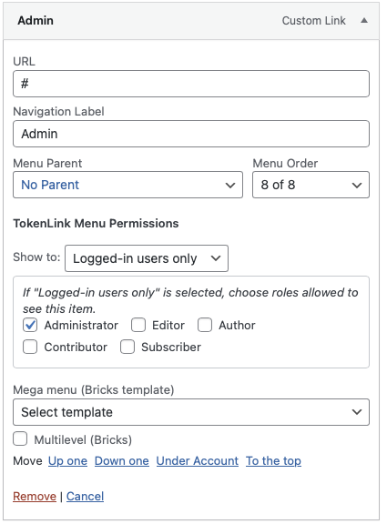

  <picture>
    <source media="(min-width: 768px)" srcset="assets/banner-1544x500.png">
    
  </picture>

# TokenLink Menu Permissions

**Contributors:** [mailborder](https://github.com/jcbenton)  
**Donate link:** [https://donate.stripe.com/14AdRa6XJ1Xn8yT8KObfO00](https://donate.stripe.com/14AdRa6XJ1Xn8yT8KObfO00)  
**Tags:** menu, permissions, visibility, roles  
**Requires at least:** 5.0  
**Tested up to:** 6.8  
**Requires PHP:** 7.4  
**Stable tag:** 1.0.3  
**License:** GPLv3 or later  
**License URI:** [https://www.gnu.org/licenses/gpl-3.0.html](https://www.gnu.org/licenses/gpl-3.0.html)

Adds per-menu-item visibility controls (everyone / logged-in / logged-out + roles) for WordPress menus.

---

## 🧩 Description

**TokenLink Menu Permissions** is a lightweight, zero-bloat WordPress plugin that lets you control which users can see specific menu items.

Each menu item in **Appearance → Menus** gains new visibility options:

- **Everyone** — visible to all visitors.  
- **Logged-in users only** — visible only when a user is logged in.  
- **Logged-out users only** — visible only to guests.  
- Optionally restrict visibility to one or more specific **user roles** (Administrator, Editor, Subscriber, etc.).

If a parent menu item is hidden, all its child items are automatically hidden as well.

### ✨ Key Features
- Adds visibility controls directly in menu item settings.  
- Supports per-item role-based visibility.  
- Automatically hides child items of hidden parents.  
- Role checkboxes are automatically disabled when not applicable.  
- Works with all standard themes and `wp_nav_menu()` implementations.  
- No external dependencies, scripts, or database tables.  
- Fully compatible with caching and custom roles.

Designed for developers and site owners who want precision and performance without the bloat of large public plugins.

---

## ⚙️ Installation

You can install **TokenLink Menu Permissions** using one of three methods:

### 🧭 1. Install from the WordPress Plugin Directory
1. In your WordPress dashboard, go to **Plugins → Add New**.  
2. Search for **“TokenLink Menu Permissions”**.  
3. Click **Install Now**, then **Activate**.  
4. Navigate to **Appearance → Menus**.  
5. Edit any menu item to configure its **visibility options**, then **Save Menu**.

### 📦 2. Upload the Plugin ZIP File
1. Download the latest release from the [WordPress Plugin Directory](https://wordpress.org/plugins/tokenlink-menu-permissions/) or from [GitHub Releases](https://github.com/jcbenton/tokenlink-menu-permissions/releases).  
2. In your WordPress dashboard, go to **Plugins → Add New → Upload Plugin**.  
3. Choose the downloaded `tokenlink-menu-permissions.zip` file and click **Install Now**.  
4. Click **Activate Plugin** once installed.  
5. Go to **Appearance → Menus** and edit menu items as needed.

### 🛠️ 3. Manual Installation (FTP or File Upload)
1. Download and extract the plugin ZIP file.  
2. Upload the folder `tokenlink-menu-permissions` to your `/wp-content/plugins/` directory via FTP or file manager.  
3. Activate the plugin from **Plugins → Installed Plugins**.  
4. Go to **Appearance → Menus** to set visibility for each menu item.  

---

📥 **Latest GitHub Release:**  
[https://github.com/jcbenton/tokenlink-menu-permissions/releases](https://github.com/jcbenton/tokenlink-menu-permissions/releases)

---

## 💡 Frequently Asked Questions

**Does this plugin modify or replace existing menus?**  
No. It only hides menu items based on the viewer’s status or role.

**What happens to child menu items if the parent is hidden?**  
They’re automatically hidden to prevent orphaned links.

**Can I restrict menu items by capability instead of role?**  
Not yet — role-based control provides clearer and safer access management.

**Does this work with custom walker or mega-menu plugins?**  
Yes, as long as they rely on the core `wp_nav_menu()` function.

**Is JavaScript required?**  
Only in the admin UI to gray-out role checkboxes. The front-end filtering is purely PHP.

---

## 🖼️ Screenshots

Screenshots are located in the `/assets/` directory.

  
   *Menu item visible to all visitors.*

  
   *Parent “Account” menu item displayed to all users.*

  
   *“Account” submenu item shown only to logged-in users.*

  
   *“Account” parent item with a “Login” submenu displayed to logged-out visitors.*

  
   *“Admin” menu item shown only to logged-in users with the Administrator role.*

---

## 🧾 Changelog

### 1.0.3
- Updated for WordPress coding standards compliance.  
- Improved internal consistency and formatting.  

### 1.0.2
- Code fix for WordPress standards.

### 1.0.1
- Initial public release.  
- Added admin-UI role toggle JavaScript.  
- Improved role handling and parent-child filtering.

---

## 🚀 Upgrade Notice

### 1.0.3
No user action required for this update.

---

## 👨‍💻 Credits

Developed by **[Jerry Benton](https://www.mailborder.com)**  
GitHub: [https://github.com/jcbenton/tokenlink-menu-permissions](https://github.com/jcbenton/tokenlink-menu-permissions)

---

## ⚖️ License

This plugin is free software, distributed under the terms of the **GNU General Public License v3 or later**.  
See [https://www.gnu.org/licenses/gpl-3.0.html](https://www.gnu.org/licenses/gpl-3.0.html) for full license text.